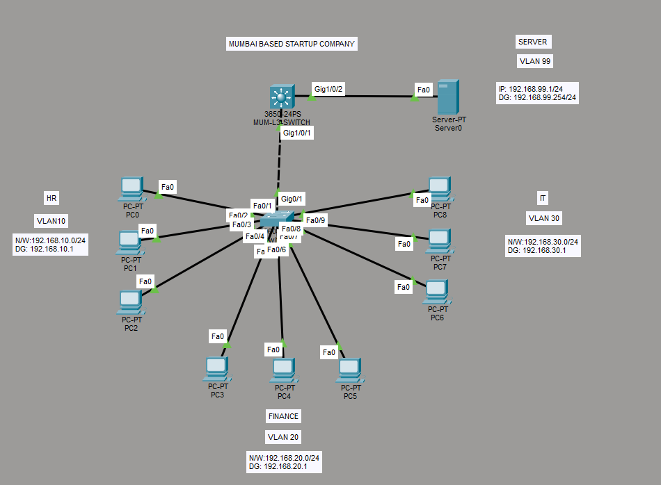
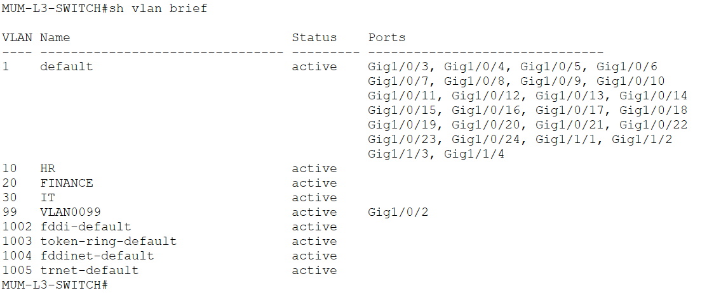
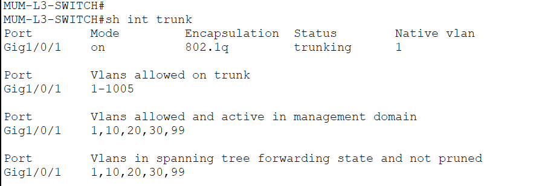
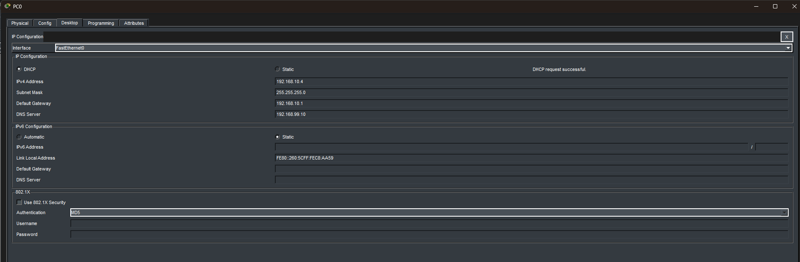
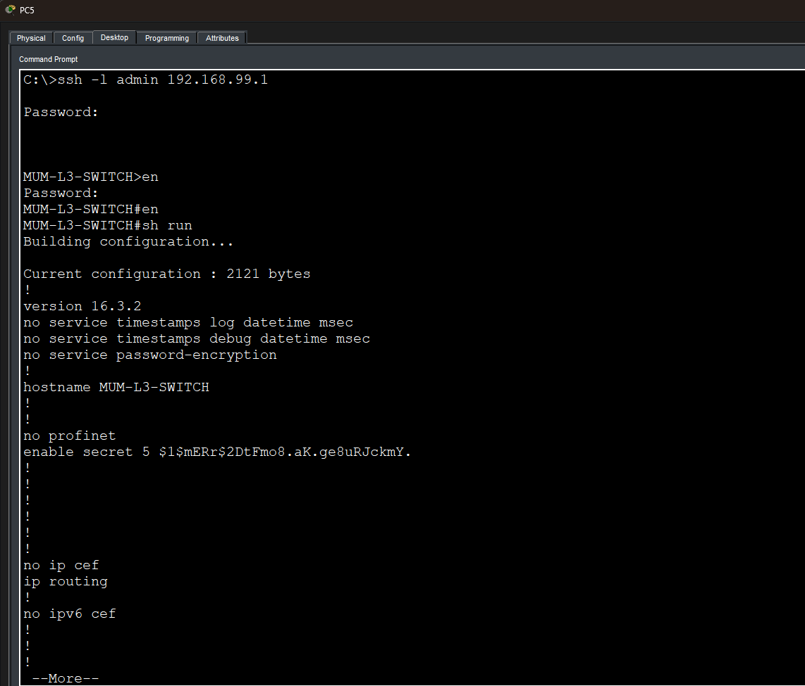
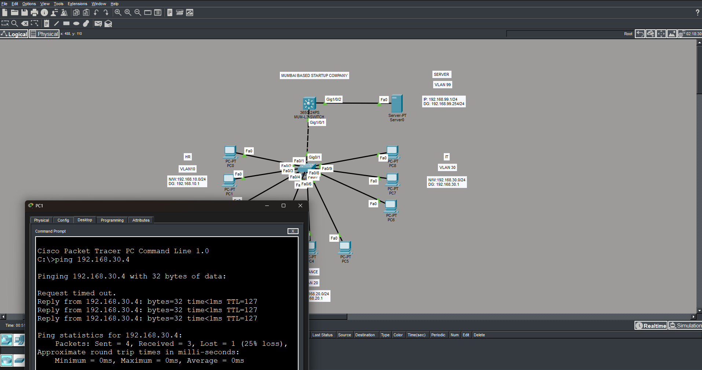

# Lab 01 — Enterprise Startup Office Network

## Scenario
A Mumbai-based startup company required a secure and scalable office network infrastructure using VLAN segmentation and centralized services.

## Technologies Implemented
- VLAN Segmentation
- Inter-VLAN Routing
- Layer 3 Switching
- DHCP Server
- DHCP Relay
- Trunking
- SSH Remote Access

## VLAN Information

| VLAN | Department | Network | Gateway |
|------|-------------|----------|----------|
| 10 | HR | 192.168.10.0/24 | 192.168.10.1 |
| 20 | Finance | 192.168.20.0/24 | 192.168.20.1 |
| 30 | IT | 192.168.30.0/24 | 192.168.30.1 |
| 99 | Server | 192.168.99.0/24 | 192.168.99.1 |

## Network Topology

## Verification

### VLAN Verification

### Trunk Verification

### DHCP Verification

### SSH Verification

### PINT TEST BETWEEN DIFFERENT VLAN's

