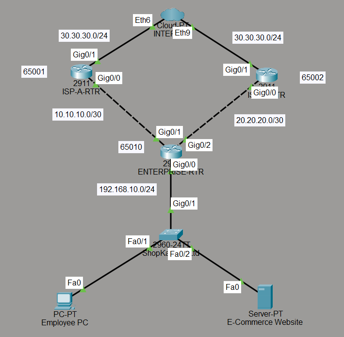
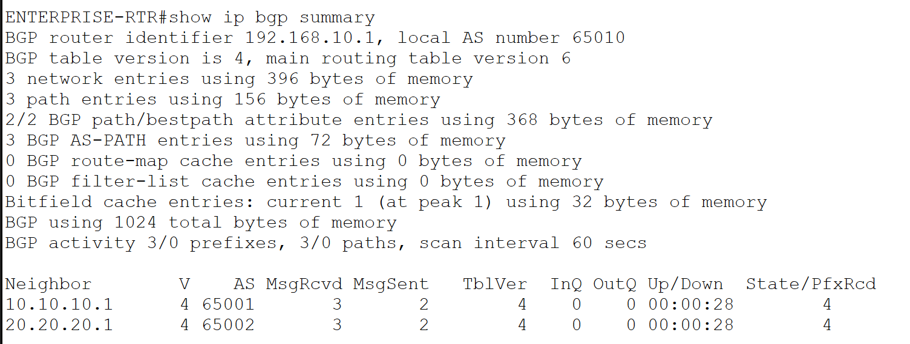
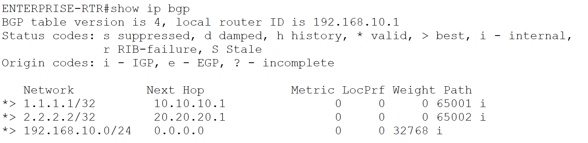
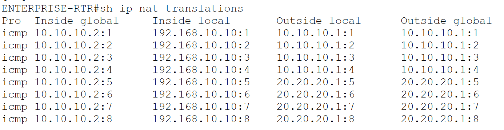
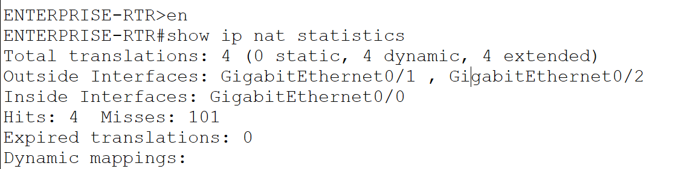
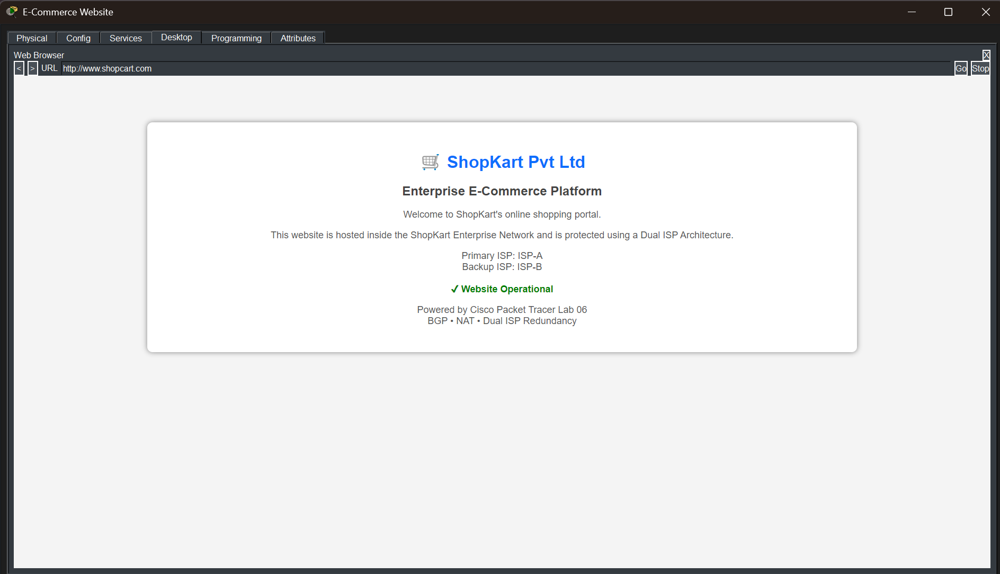
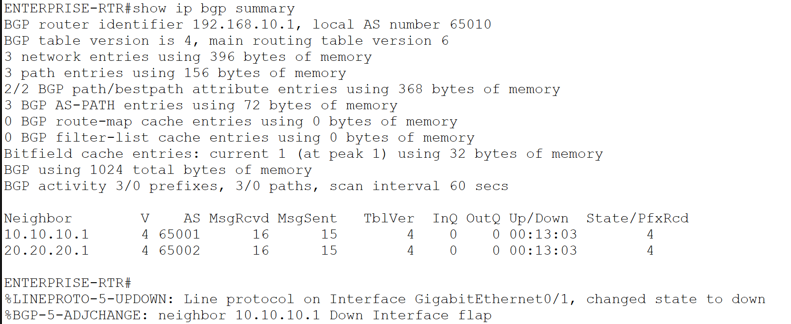
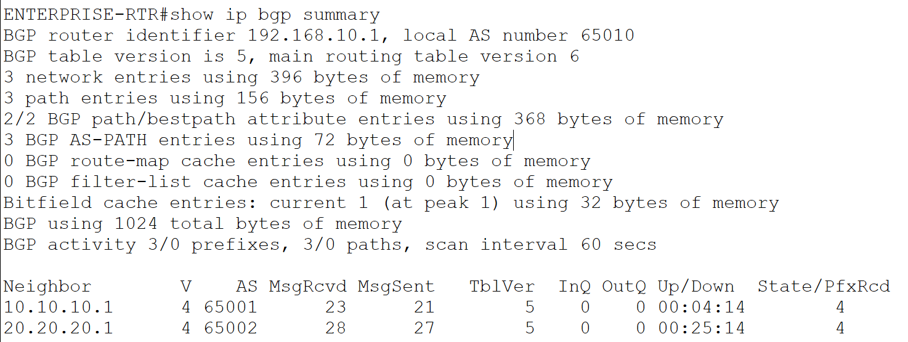
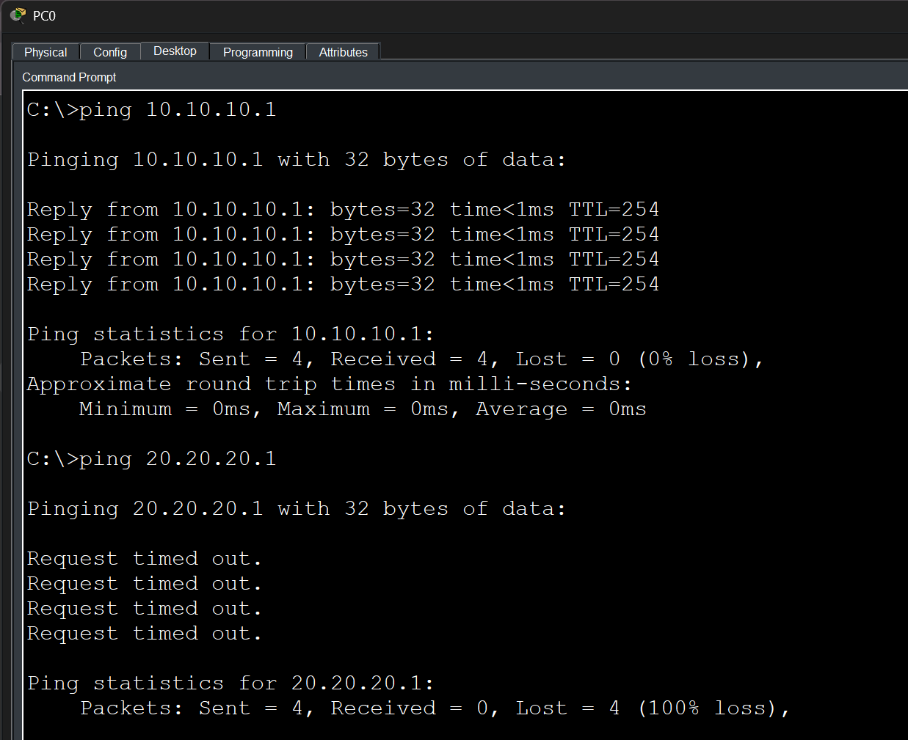

# Lab 05 – ISP Mini Infrastructure with Enterprise Internet Redundancy

## Overview

This lab simulates a real-world enterprise network connected to two Internet Service Providers (ISPs) using Border Gateway Protocol (BGP). The objective is to provide uninterrupted internet connectivity through ISP redundancy while demonstrating BGP neighbor establishment, route advertisement, NAT/PAT, and failover testing.

### Business Scenario

**ShopKart Pvt Ltd** is an e-commerce company that hosts its online shopping platform for customers across India. Since website availability is critical for business operations, the company maintains connections with two different ISPs.

* **ISP-A** acts as the primary ISP.
* **ISP-B** acts as the backup ISP.
* **BGP** is used for route exchange and redundancy.
* **NAT/PAT** allows internal users to access external networks.
* **DNS & HTTP Services** host the company's shopping portal.

In the event of an ISP failure, connectivity can continue through the remaining ISP, minimizing downtime.

---

## Technologies Used

* BGP (Border Gateway Protocol)
* NAT Overload (PAT)
* Static Routing
* DNS
* HTTP Server
* Dual ISP Connectivity
* Network Redundancy
* Cisco Packet Tracer

---

## Network Topology

### Full Topology



The enterprise network is connected to two ISPs through separate WAN links. A web server hosts the ShopKart website, while BGP provides connectivity and redundancy.

---

## IP Addressing Scheme

| Device            | Interface | IP Address       |
| ----------------- | --------- | ---------------- |
| Enterprise Router | G0/0      | 192.168.10.1/24  |
| Enterprise Router | G0/1      | 10.10.10.2/30    |
| Enterprise Router | G0/2      | 20.20.20.2/30    |
| ISP-A Router      | G0/0      | 10.10.10.1/30    |
| ISP-B Router      | G0/0      | 20.20.20.1/30    |
| ISP-A Loopback    | Lo0       | 1.1.1.1/32       |
| ISP-B Loopback    | Lo0       | 2.2.2.2/32       |
| Web Server        | Fa0       | 192.168.10.20/24 |
| Employee PC       | Fa0       | 192.168.10.10/24 |

---

## BGP Configuration

### Autonomous Systems

| Device     | AS Number |
| ---------- | --------- |
| ISP-A      | AS65001   |
| ISP-B      | AS65002   |
| Enterprise | AS65010   |

### BGP Neighbor Establishment

Enterprise Router forms eBGP peering with both ISPs.

#### Verification



The output confirms successful BGP neighbor establishment with both service providers.

---

## Route Advertisement

ISP-A advertises:

```text
1.1.1.1/32
```

ISP-B advertises:

```text
2.2.2.2/32
```

Enterprise advertises:

```text
192.168.10.0/24
```

### Verification



---

## NAT Overload (PAT)

NAT is configured on the Enterprise Router to allow internal users to access external networks using a public-facing address.

### Verification



### NAT Statistics



---

## DNS Service

A DNS record was configured for the company website.

| Domain Name                                 | IP Address    |
| ------------------------------------------- | ------------- |
| [www.shopkart.com](http://www.shopkart.com) | 192.168.10.20 |

The DNS server resolves the company website to the internal web server.

---

## HTTP Service

The ShopKart web portal is hosted on the internal web server.

### Website Access



Users can access:

```text
http://www.shopkart.com
```

through DNS name resolution.

---

## ISP Failover Testing

To validate redundancy, the primary ISP connection was intentionally disabled.

### Failure Event



BGP detected the loss of connectivity to ISP-A and removed the affected neighbor relationship.

### Recovery



After restoring the interface, BGP automatically re-established the session.

---

## Connectivity Testing

### Successful Reachability Test



The enterprise network successfully communicates with ISP infrastructure.

---

## Key Learning Outcomes

* Configured eBGP between multiple autonomous systems.
* Implemented dual ISP enterprise connectivity.
* Advertised and learned routes using BGP.
* Configured NAT Overload (PAT).
* Hosted DNS and HTTP services.
* Simulated ISP failure and recovery.
* Verified enterprise network redundancy.

---

## Real-World Applications

This architecture is commonly used by:

* E-Commerce Companies
* Enterprise Headquarters
* Data Centers
* Financial Institutions
* Cloud Service Providers

where continuous internet availability is critical for business operations.
